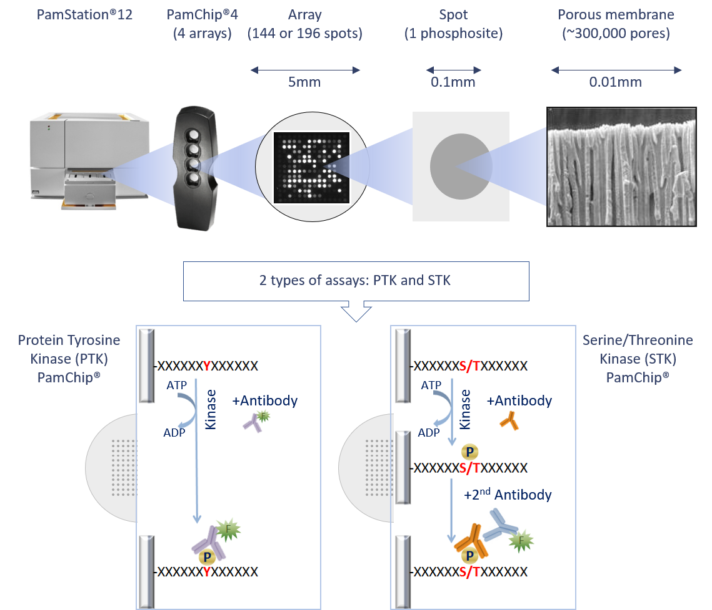
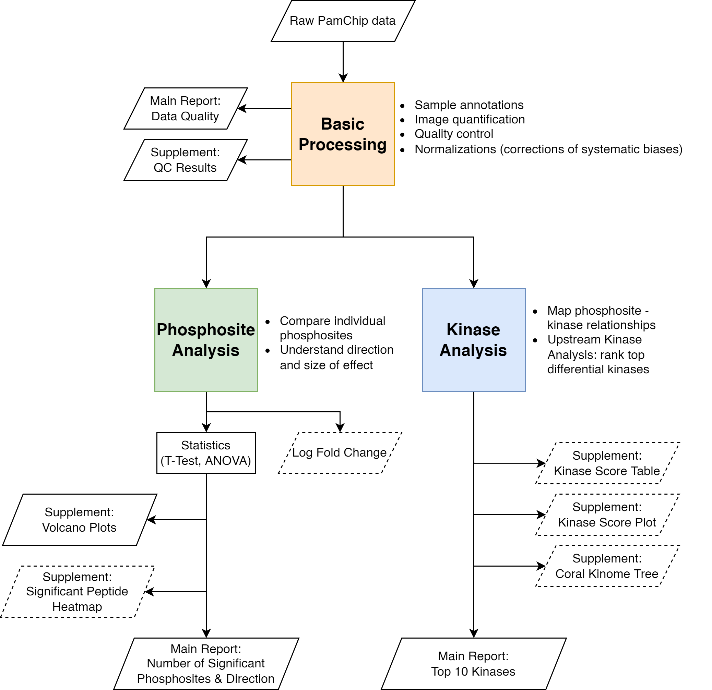

```{r setup, include=FALSE}
knitr::opts_chunk$set(echo = FALSE, warning = FALSE, message = FALSE)
library(tidyverse)
library(flextable)
source("R/00_GeneralFunctions.R")
source("R/01_BasicProcessing.R")
source("R/02_PhosphositeAnalysis.R")
source("R/03_KinaseAnalysis.R")

```

\pagebreak
# Introduction

This supplement gives a detailed explanation of the methods used in the main study report.

With PamGene's kinase activity profiling platform, the activity of kinases in a wide range of cells and tissues can be measured in real time. We use our proprietary 3D peptide microarray technology (PamChip® and PamStation®) which offers a multiplex method for global kinase activity profiling. The assay is very sensitive, requiring only a small amount of lysate to measure the activity of kinases in various samples including cell lines, xenografts and human tissues. Lysates obtained from a few thousand cells can suffice to obtain a kinome profile of the multiple kinases present in these samples. This is accomplished by incubating the sample lysates across peptide substrates immobilized on the 3D surface of the PamChip® microarray (196 protein tyrosine kinase (PTK) or 144 serine/threonine kinase (STK), hereafter referred to as phosphosites). Kinases present in the lysates will phosphorylate the phosphosites, which are visualized using fluorescently labelled antibodies.

## PamChip Technology and Assay Principle

PamGene's microarray assay for kinase activity profiling is based on measuring phosphorylation of phosphosites by protein kinases. The PamChip® 4 consumable consists of 4 identical arrays, each array containing 144 (STK) or 196 (PTK) phosphosites immobilized on a porous ceramic membrane (Figure 1). These phosphosites are encoded in 13 amino acid long peptides which derived from literature or computational predictions. with the phosphorylation of these phosphosites is then used to predict one or multiple upstream kinases (Protein tyrosine kinases for the PTK PamChip® and Serine threonine kinases for the STK PamChip®). Fluorescently labelled anti-phospho-antibodies are used to detect phosphorylation activity of kinases present in the sample (Figure 1).

During the assay, the sample is pumped through the porous membrane, allowing for shorter assay times. When the solution is underneath the array, images of each array are taken at several exposure times by a camera in the workstation (Figure 1). Images are later used by the BioNavigator® software to calculate signal values for each phosphosite. The data workflow consisting of image quantification, quality control, statistical analysis, visualization and interpretation is performed using the BioNavigator® software.

```{r assay-principle, message=FALSE, fig.align='center', fig.cap='PamGene technology outline and PamChip assay principle.'}

```
\newpage

# Data Analysis

## Data Analysis Overview

The general workflow for data analysis is shown below (Figure 2), which was used to derive the results described in the Report and this Supplement, with details following.

```{r analysis-workflow, message=FALSE, fig.align='center', fig.cap='Data analysis workflow. Parallelograms indicate in- and outputs. Dashed lines indicate optional outputs. Basic Processing (orange box) refers to Section 2.2 of this supplement. Phosphosite Analysis (green box) refers to Section 2.3. Kinase Analysis (blue box) refers to Section 2.4. The output of Phosphosite Analysis and Kinase Analysis can be used for further biological interpretation (see also Section 2.5).', fig.width=6.3, fig.height=6.3}

```

\newpage

## Basic Processing

### Image Analysis and Signal Integration

**Image Analysis**

Image analysis is performed on each image. Once a grid is constructed for the image, various values (quantitation types) are calculated. The main value considered as the “signal” is called the `Median_SigmBg` (median signal minus background). Signal_Saturation (fraction of saturated pixels) values are used to remove saturated spots during signal integration.

**Exposure Time Integration**

Low exposure times are useful to capture high intensity signals, and likewise high exposure times are useful to capture low intensity signals. Therefore, the same image is acquired at multiple exposure times, and then `Median_SigmBg` values are integrated to a single value, called the S100 signal. Since saturated spots (5% saturation) are excluded in the integration, the dynamic range of the measurements is increased (the ratio of the highest and lowest signal that can be measured).

### Quality Control

The quality of the data was assessed using criteria shown in Table 1. The QC results for the data in this study are shown in Table 2.

Three criteria were checked using a flag system is used to indicate a quality level:

* Phosphosite signal strength (i.e., the 99th percentile of S100 AU (arbitrary units). 

* Phosphosite number control (i.e., how many phosphosites passed quality control).

* Sample quality control (i.e., Replicate CV (coefficient of variance); An example of technical replicate is 1 sample lysate on 3+ arrays; An example of biological replicate is 1 sample lysate per array).

```{r ref qc table}
render_ref_qc_table()
```

**Number of QC-passed phosphosites (PTK)**

To select high quality phosphosites for the PTK assay, it is assessed whether peptide signals show a positive or negative trend during incubation. This is done by performing linear regression on kinetic curves. Peptides with positive trend in less than 25% of samples are excluded by default.


\newpage

**Number of QC-passed phosphosites (STK)**

```{r, echo=FALSE, results='asis'}
if (params$stk_qc_method == "LOD") {
  cat("To select high quality phosphosites for the STK assay, it is assessed whether peptide signal is above the Limit of Detection (LOD). Peptides above LOD in less than 25% of samples are excluded by default. The LOD is calculated based on the signal of the prephosphorylated peptides and based on datasets with technical replicates.")
} else if (params$stk_qc_method == "nom_cv") {
  cat("To select high quality phosphosites for the STK assay, nominal CV is estimated on after wash (Cycle 124) values. Since high CV correlates with low signal phosphosites, phosphosites with a CV higher than 50% over all measured arrays are excluded from the analysis by default.")
}
```


```{r qc table}
qc_files <- read_qc_dir()
if (nrow(qc_files) > 0) {
  qc_assay_types <- qc_files %>% pull(Assay_Type)
  make_qc_table(qc_files, params$qc_cv_factor, params$datatype)
} else {
  qc_assay_types <- ""
}
```


### Normalizations

```{r, echo=FALSE, results='asis'}
if (is.null(params$normalizations)) {
  cat("Log normalization was applied.")
} else {
  cat("In this study, the following normalization(s) has been applied:\n\n")
  if ("vsn" %in% params$normalizations) {
    cat("* Variance Stabilizing Normalization (VSN)\n\n")
  } 
  if ("combat" %in% params$normalizations) {
    cat("* ComBat Correction\n\n")
  }
  if ("vsn" %in% params$normalizations) {
    cat("**VSN** [@huber_variance_2002]: In log-transformed data, variance increases with decreasing signal mean. This means that a certain log fold change is more significant for high-signal phosphosites (low variance) than for low-signal phosphosites (high variance). VSN adresses this by rendering the variance independent of the mean, thereby facilitating the discovery of significant phosphosites with low signal intensities. It also enables comparison of large sample sets, e.g. multiple PamStation runs. 
    VSN normalization has two steps:\n
1. Affine transformation – centers and scales the data. This results in comparisons based on relative changes - deviations from the overal mean - rather than absolute values. For example, in a sample with higher overal kinase activity, VSN identifies kinases with above- and below-average activity, emphasizing key drivers.\n
2. Log transformation (log-equivalent transformation).\n\n")
  }
  if ("combat" %in% params$normalizations) {
    cat("**ComBat correction** [@johnson_adjusting_2007; @chen_removing_2011]: ComBat is a batch effect correction method. Batch effects are systematic technical effects due to variabilities in time, place, and materials. These effects can reduce the accuracy of the results, thus they have to be counteracted. ComBat corrects for systematic biases (e.g., differences between PamStation runs, PamChips, or replicates). ComBat correction is equivalent to Z-score scaling per batch, but the scaling parameters (mean/sd) are estimated using an empirical Bayes approach, which effectively reduces the noise associated with applying the correction.\n\n")
  }
}
```


`r if (params$signal_heatmap != "yes") {"\\begin{comment}"}`
### Visual assessment of overall signal

The basic processing steps as described above result in log2-transformed or VSN-normalized values (with or without ComBat) for each peptide (rows) and each array (columns). The heatmap(s) below provide an overview of samples and measurements. This view helps to indicate possible trends and outliers. Signals before normalization are provided separately and signals after normalization are shown below. 

```{r, results='asis'}
template <- "**Heatmap Overview - %s**"

for (assay_type in qc_assay_types) {
  cat(sprintf(template, assay_type))
  cat("  \n")
  cat("  \n")
  
  if ("vsn" %in% params$normalizations & !"combat" %in% params$normalizations){
    cat("##### The heatmap shows VSN-normalized values of the integrated signal. Each row is a phosphosite and each column is a PamChip array. Rows are sorted by row mean and only include phosphosites which passed the QC.")
  } else if ("vsn" %in% params$normalizations & "combat" %in% params$normalizations){
    cat("##### The heatmap shows VSN-ComBat-normalized values of the integrated signal. Each row is a phosphosite and each column is a PamChip array. Rows are sorted by row mean and only include phosphosites which passed the QC.")
  } else if (!"vsn" %in% params$normalizations & "combat" %in% params$normalizations){
    cat("##### The heatmap shows Log2-ComBat-normalized values of the integrated signal. Each row is a phosphosite and each column is a PamChip array. Rows are sorted by row mean and only include phosphosites which passed the QC.")
  } else if (!"vsn" %in% params$normalizations & !"combat" %in% params$normalizations){
    cat("##### The heatmap shows Log2-values of the integrated signal. Each row is a phosphosite and each column is a PamChip array. Rows are sorted by row mean and only include phosphosites which passed the QC.")
  }
  cat("  \n")
}

```

`r if (params$signal_heatmap != "yes") {"\\end{comment}"}`


\newpage

## Phosphosite analysis

`r # volcano_text_printed <- FALSE`

### Differential statistical analysis methods: “Test condition(s)” versus “Control”

To identify significant differences between the conditions at the phosphosite level, the following statistical tests are used: 
```{r stats methods, echo=FALSE}
stats_files <- read_phosphosite_dir(datatype = params$datatype)
if (nrow(stats_files) > 0) {
  assay_types <- stats_files %>% distinct(Assay_Type) %>% pull()
} else {
  assay_types <- ""
}
```


```{r, echo=FALSE, results='asis'}
if ("MTvC" %in% stats_files$Stats) {
  cat("* Multiple Test conditions versus Control (MTvC): To compare 2 or more Test Conditions versus Control. An ANOVA is performed for significant effects anywhere between the Test Conditions (including control). A Dunnett’s post-hoc test is then performed for multiple comparisons to find significant effects between each Test Condition.\n\n")
}
if ("TT" %in% stats_files$Stats) {
  cat("* T-test (TT): To compare one Test Condition versus Control, two-sided Student’s T-test (paired or unpaired) are performed.\n\n")
}
if ("Limma" %in% stats_files$Stats) {
  cat("* LIMMA (Linear Models for Micro Arrays): LIMMA, instead of analyzing each peptide in isolation, uses information from all the peptides and conditions in the experiment to improve its analysis. Applying LIMMA leads to results with increased statistical power over individual testing per peptide.\n\n")
}
```

The following plot(s) show the results from the statistical tests:

* Volcano plot, useful for an overview of the Test condition vs control. Volcano plots visualize the significance (y-axis, -log10(p value)) versus the effect size (x-axis, LFC or delta) of each test. Red dots are phosphosites that show significant difference compared to control (p<0.05, i.e. -log10(p)>1.3).

```{r, echo=FALSE, results='asis'}
if ("heatmap" %in% params$normalizations) {
  cat("* Significant phosphosites (LFC or Scaled heatmaps) - provided separately.\n\n")
}
```


Results from the above tests are provided in Excel-readable format. 
The phosphosite level statistical tests result in LFC and p-values for each Peptide sequence. Each sequence can have a > 90% similarity match with 1 or more proteins. Therefore the Report results folder contains additional [*_enriched.csv] files that contain annotation of Sequence, UniPROT ID and Primary Gene name. This is useful for biological interpretation or pathway and network analyses. The LFC and p-values are the same for each unique Peptide ID across the different matching proteins.


\newpage
### Volcano plots

```{r mtvcvolcanos, fig.cap = paste("MTvC Volcano Plots", if(nrow(stats_files) > 0) {stats_files %>% filter(Stats == "MTvC") %>% pull(Group)}), dpi=150, fig.height=3 * length(assay_types)}

if(nrow(stats_files) > 0) {
  if ("MTvC" %in% stats_files$Stats) {
    plot_list <- make_volcano_plots(stats_files, stats_type = "MTvC", datatype = params$datatype)
    for (i in seq_along(plot_list)) {
      print(plot_list[[i]])
    }
  }
}

```

```{r mtvcheatmaps, fig.cap = paste("MTvC Significant Peptide Heatmaps", if(nrow(stats_files) > 0) {stats_files %>% filter(Stats == "MTvC") %>% pull(Group)}), dpi=150, fig.height=6, fig.width = 3 * length(assay_types)}
if (nrow(stats_files) > 0) {
  if ("MTvC" %in% stats_files$Stats) {
    if ("heatmap" %in% params$`phosphosite_heatmap`) {
      heatmaps <- make_heatmaps(stats_files, stats_type = "MTvC", datatype = params$datatype)
    }
    # heatmaps are not printed in the report anymore - they are provided separately
    # if ("heatmap" %in% params$`phosphosite_heatmap`) {
    #   for (i in seq_along(heatmaps)) {
    #       print(heatmaps[[i]])
    #     }
    #   }
  }
}

```


```{r ttvolcanos, fig.cap = paste("T-Test Volcano Plots", if (nrow(stats_files) > 0) {stats_files %>% filter(Stats == "TT") %>% pull(Comparison)}), dpi=150, fig.width=2.5 * length(assay_types), fig.height=3}

if (nrow(stats_files) > 0) {
  if ("TT" %in% stats_files$Stats) {
    plot_list <- make_volcano_plots(stats_files, stats_type = "TT", datatype = params$datatype)
    for (i in seq_along(plot_list)) {
      print(plot_list[[i]])
      
    }
  }
}

```


```{r ttheatmaps, fig.cap = paste("T-Test Significant Peptide Heatmaps", if (nrow(stats_files) > 0) {stats_files %>% filter(Stats == "TT") %>% pull(Comparison)}), dpi = 150, fig.width = 6, fig.height = 7}

if (nrow(stats_files) > 0) {
  if ("TT" %in% stats_files$Stats) {
    if ("heatmap" %in% params$`phosphosite_heatmap`) {
      heatmaps <- make_heatmaps(stats_files, stats_type = "TT", datatype = params$datatype)
    }
    # heatmaps are not printed in the report anymore - they are provided separately
    # if ("heatmap" %in% params$`phosphosite_heatmap`) {
    #   for (i in seq_along(heatmaps)) {
    #       print(heatmaps[[i]])
    #     }
    #   }
  }
}

```


```{r limmavolcanos, fig.cap = paste("Limma Volcano Plots", if(nrow(stats_files) > 0) {stats_files %>% filter(Stats == "Limma") %>% pull(Group)}), dpi=200, fig.width=6, fig.height=8.5}

if(nrow(stats_files) > 0) {
  if ("Limma" %in% stats_files$Stats) {
    plot_list <- make_volcano_plots(stats_files, stats_type = "Limma", datatype = params$datatype)
    for (i in seq_along(plot_list)) {
      print(plot_list[[i]])
    }
  }
}
```


```{r limmaheatmaps, fig.cap = paste("Limma Significant Peptide Heatmaps", if(nrow(stats_files) > 0) {stats_files %>% filter(Stats == "Limma") %>% pull(Group)}), dpi=150, fig.height=6, fig.width = 3 * length(assay_types)}
if (nrow(stats_files) > 0) {
  if ("Limma" %in% stats_files$Stats) {
    if ("heatmap" %in% params$`phosphosite_heatmap`) {
      heatmaps <- make_heatmaps(stats_files, stats_type = "Limma", datatype = params$datatype)
    }
  }
}
```


\newpage

## Kinase Analysis

### Differential upstream kinase analysis methods: “Test condition(s)” versus “Control”

The **Upstream Kinase Analysis (UKA)** algorithm predicts differential kinase activity in a Test Condition compared to Control. The UKA is a functional class scoring method: to predict a kinase, it analyzes the changes in its set of phosphosites. A phosphosite set of a kinase comes from public databases of kinase-protein-phosphosite relationships. The UKA assigns scores to the predicted kinases indicating how strongly the kinase is associated with the observed changes in peptide signal. UKA is run on all QC-passed peptides, not only on significant peptides. 
The results can be used to generate hypotheses and the selected kinases need to be further validated. Whether they make sense in a biological context is dependent on several factors (e.g., the model system used in the experiments) and requires further consideration.

The UKA algorithm returns the following scores:

* **Kinase Statistic**: represents the direction of effect: the change in kinase activity in a Test condition (T) compared to a Control condition (C). < 0 means inhibition, > 0 means activation in T versus C. The Kinase Statistic is the median of the Peptide Statistics of the set of peptides that a kinase can phosphorylate. The Peptide Statistic is the signal-to-noise ratio of peptides between T and C. Thus, the Kinase Statistic represents the log fold change scaled by the noise. 

* **Significance Score**: the significance of the Kinase Statistic is based on a permutation test where the samples are permuted. The Kinase Statistic is recalculated for each permutation. The Significance Score is based on the difference between the Kinase Statistic of the actual sample versus that of the permuted samples. A high Significance Score means a high probability that the kinase is differentially active between Test and Control.

* **Specificity Score**: the specificity of the Kinase Statistic is based on a permutation test, where the peptides are permuted. The Kinase Statistic is recalculated for each permutation.  The Specificity Score is based on the difference between the Kinase Statistic of the actual sample versus that of the permuted samples. A high Specificity Score means a high probability that the observed effect could not have been obtained by a random set of peptides. 

* **Kinase Score (Median Final Score)**: the sum of the Significance Score and the Specificity Score. Kinases are ordered by this score. 

To learn more about the calculation of these scores, refer to: https://pamgene.com/wp-content/uploads/2024/08/Flyer_PamGene-Upstream-Kinase-Analysis-Tool.pdf


```{r include=any(c("splotf", "splots", "table", "tree") %in% params$kinase_analysis), results ='asis'}
cat("The UKA algorithm generates the following plots:")
```

```{r include="table" %in% params$kinase_analysis, results='asis'}
cat("* **Kinase Score Table**, useful to identify the top kinases. The Score Table shows the top 10 kinases regardless of the Kinase Scores.")
```

```{r include= any(c("splotf", "splots") %in% params$kinase_analysis), results='asis'}
cat("* **Kinase Score Plot**, useful to identify the effect size and direction of the top 20 kinases. Plots are colored by Specificity Score or kinase family. When a kinase family is represented by only 1 kinase from the Top 20 list, the bars are coloured grey. The Score Plots show the top 20 kinases, regardless of the Kinase Scores.")
```

```{r include= "tree" %in% params$kinase_analysis, results='asis'}
cat("* **Kinome Tree**, useful to group the kinases into phylogenetic families. The Coral Trees show all kinases above the default threshold (Kinase Score > 1.3). 
You can also generate and fine tune your own Coral Trees [here](http://phanstiel-lab.med.unc.edu/CORAL/).")
```

Results are provided as Excel (csv) files (Data tables/UKA_PTK or UKA_STK). The column Median Final Score (= Kinase Score) is used for the ranking, thus enabling selection of kinases above the default threshold (Kinase Score > 1.3).
For more details of this algorithm  refer to: https://pamgene.com/ps12/. 

A general guideline below can be used to infer biological interpretation from the UKA results. PamGene can support and discuss these approaches.

1. Use the UKA tool to give a ranked predicted list of kinases
2. Select top kinase(s) based on:
    + Ranking order
    + Threshold cut-off (subjective; guideline is to use Median Final score > 1.3)
    + Known biological information
3. Further validate the selected kinase based on:
    + Biological context inferred from current knowledgebase and literature
    + Other platforms and technologies
  
More details of this algorithm are available on request. Results are provided as Excel (txt) files. 

\newpage
### Kinase Analysis Results

```{r kinase files}
kinase_files <- read_csv("temp/kinase_files.csv")
if (nrow(kinase_files) > 0) {
  assay_types <- kinase_files %>% pull(Assay_Type) %>% unique(.)
} else {
  assay_types <- ""
}
```

```{r kinasetables, echo=FALSE, results='asis', dpi=150, fig.width=3 * length(assay_types)+.5, fig.height=4}
if (nrow(kinase_files) > 0) {
  output_kinase_analysis(kinase_files, kin_params = params$`kinase_analysis`, xax_scale = params$`xax_scale`,
                         coral_ks_thrs = params$`coral_ks_thrs`, coral_min = params$`coral_min`, 
                         coral_max = params$`coral_max`, fscore_thr = params$`fscore_thr`)
}

```

\newpage
# Report information table

```{r report information table}
data.frame("Deliverable" = c("Excel tables with all data: DATA FILES folder", "What’s in Main Report", 
                             "What’s in Supplement", "Additional figures in folders", 
                             "Additional information for data analysis and interpretation"),
          "Top peptides" = c("Filenames starting with Limma or TT (=T-Test) or MTvC (Anova-Dunnett test).", 
                             "QC assessment; Normalizations; Number of significant peptides (p < 0.05) with differential phosphorylation in Test vs Control.",
                             "Volcano plots", "All figures in Report: Volcano plots and Heatmaps of significant peptides.", 
                             "See Supplement end: Tools for biological interpretation, and Suggestions for validating results. Upon request, and confidential clause, not for distribution: UKA Database."),
          "Top kinases" = c("Filenames starting with UKA.", 
                            paste0("Top 10 significant (Median Final score > ", params$fscore_thr, ") kinases with differential activity in Test vs Control."), 
                            "Bar plots of Top 20 kinases regardless of cut-off, coloured by family / specificity scores;  Tables of Top 10 kinases regardless of cut-off; Coral kinome trees of significant kinases.", 
                            "All figures in Report", "")
          ) %>% flextable() %>% theme_box() %>%
          set_table_properties(width = 1, layout = "autofit") %>%
    fontsize(size = 11, part = "all") %>%
    font(part = "all", fontname = "Arial") %>%
    set_header_labels(Deliverable = "Deliverable", Top.peptides = "Top peptides", Top.kinases = "Top kinases")

```

\newpage
# Tools for biological interpretation

For biological interpretation, we provide information here about pathway and network analysis tools. Refer to the Results Data Tables provided separately.
For a specific comparison you can use:

1. Phosphosite level data: we suggest to combine the PTK and STK significant results from the TT or MTvC. Use the proteins mapped to phosphosites (in the “_enriched” files). Since multiple phosphosites can map to one protein, we suggest to use the mean. (Significant phosphosites: p value<0.05; or set your own more/ less stringent cut-off). Effect direction and size: Use LFC / delta. 

2. Kinase level data: We suggest to combine the UKA_PTK and UKA_STK significant kinases (Median Final score >1.3; or set your own more/ less stringent cut-off). Effect direction and size: Use Median Kinase Statistic. 

3. Combine (1) and (2) into one table, with a column for ID (e.g. Gene name or UniprotID), and a column for the LFC values (from (1)=LFC; From (2)=Median Kinase Statistic) and save as a txt file. When there is an overlap between kinases and the proteins mapped to phosphosites, we suggest to use kinase data. 
An example dataset of significant proteins and kinases:


| Comparison | UniprotID | LFC  | from        |
|------------|-----------|------|-------------|
| T1 vs C    | P22681    | -0.4 | phosphosite |
| T1 vs C    | P13805    | 1.6  | kinase      |
| T1 vs C    | P07947    | 0.2  | kinase      |

Pathway and network analysis tools:

|  Tool                                              | Data input | Description                                                                            |
|----------------------------------------------------|------------|----------------------------------------------------------------------------------------|
| [Metascape](https://metascape.org/)                | ID         | Pathway analysis tool. Outputs non-redundant pathways.                                 |
| [Paintomics](https://paintomics.uv.es/)           | ID + LFC   | ID should be gene name or entrezid. Refer to the resources for the exact data format.  |
| [G-Profiler](https://biit.cs.ut.ee/gprofiler/gost) | ID         | Pathway analyis tool.                                                                  |
| [EnrichR](https://maayanlab.cloud/Enrichr/)        | ID         | Pathway analyis tool.                                                                  |
| [STRING](https://string-db.org/)                   | ID         | Network analysis tool.                                                                 |

The [Protein Atlas](https://www.proteinatlas.org/) is useful to verify biological context of a kinase hit. (E.g.: is LCK expressed in endothelial cells?)

To overlap the top hits across different comparisons (e.g. T1 vs C, T2 vs C, etc.) you can use [Venny](https://bioinfogp.cnb.csic.es/tools/venny/).


\newpage
# Suggestions for validating results

To validate results, we recommend selecting kinases that consistently appear with high Final and Specificity Scores in experiments carried out with at least 3 or 6 replicates per condition for cell lines or primary cell cultures respectively.

We recommend selecting kinases for validation rather than phosphosites. The reasons:

1.	PamGene analysis identifies activated kinases in the lysate by detecting phosphorylation of their targets (phosphosites) on the PamChip. It is possible that targets are not present in the lysate in their native form, but the predicted kinase is present. 

2.	Phosphorylation by a kinase on a certain phosphosite can have different outcomes. For example, induction or inhibition of the affected protein(s). 

3.	To validate predicted kinases, as one of the methods, we suggest to carry out the following experiments with Western blot, using both Test and Control lysates:
*	To validate that the kinase activity is upregulated in Test vs Control, select antibodies specific for phosphosites on the kinase that lead to induction of the kinase activity.
*	To validate that the kinase activity is downregulated in Test vs Control: choose antibodies specific for phosphosites on the kinase that lead to inhibition of the kinase activity.

Sites such as Uniprot and PhosphoSitePlus can help in choosing the specific phosphosites or PamGene can help identifying such phosphosites on request, as an additional service.

4.	If the approach to validate a kinase is not possible, validation of downstream phosphosites activated by the kinase can be performed. PamGene can help identifying such phosphosites on request.

You can find more information [here](https://pamgene.com/wp-content/uploads/2020/09/Flyer-Confirming-PamChip-Data.pdf).


# References