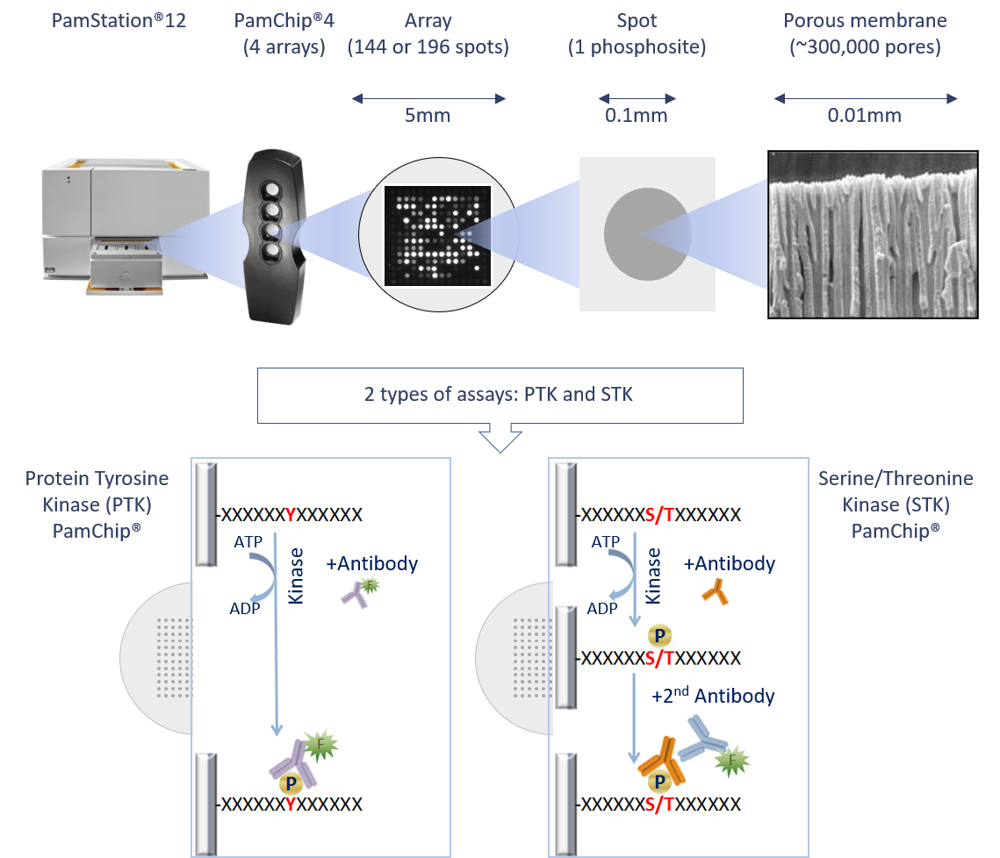
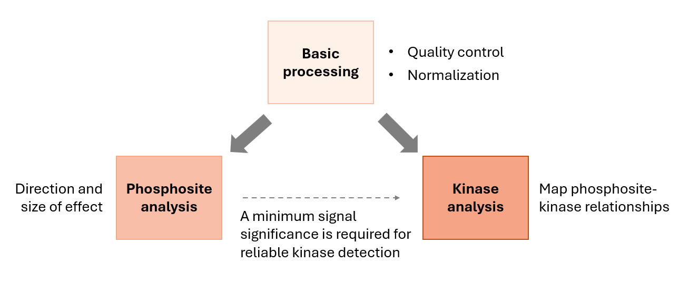

```{r setup, include=FALSE}
knitr::opts_chunk$set(echo = FALSE, warning = FALSE, message = FALSE)
library(tidyverse)
library(flextable)
source("R/00_GeneralFunctions.R")
source("R/01_BasicProcessing.R")
source("R/02_PhosphositeAnalysis.R")
source("R/03_KinaseAnalysis.R")

```

\pagebreak
# Introduction

This supplement gives a detailed explanation of the methods used in the main study report.

With PamDx's kinase activity profiling platform, the activity of kinases in a wide range of cells and tissues can be measured in real time. We use our proprietary 3D peptide microarray technology (PamChip® and PamStation®) which offers a multiplex method for global kinase activity profiling. The assay is very sensitive, requiring only a small amount of lysate to measure the activity of kinases in various samples including cell lines, xenografts and human tissues. Lysates obtained from a few thousand cells can suffice to obtain a kinome profile of the multiple kinases present in these samples. This is accomplished by incubating the sample lysates across peptide substrates immobilized on the 3D surface of the PamChip® microarray (196 protein tyrosine kinase (PTK) or 144 serine/threonine kinase (STK), hereafter referred to as phosphosites). Kinases present in the lysates will phosphorylate the phosphosites, which are visualized using fluorescently labelled antibodies.

## PamChip Technology and Assay Principle

PamDx's microarray assay for kinase activity profiling is based on measuring phosphorylation of phosphosites by protein kinases. The PamChip® 4 consumable consists of 4 identical arrays, each array containing 144 (STK) or 196 (PTK) phosphosites immobilized on a porous ceramic membrane (Figure 1). These phosphosites are encoded in 13 amino acid long peptides which derived from literature or computational predictions. with the phosphorylation of these phosphosites is then used to predict one or multiple upstream kinases (Protein tyrosine kinases for the PTK PamChip® and Serine threonine kinases for the STK PamChip®). Fluorescently labelled anti-phospho-antibodies are used to detect phosphorylation activity of kinases present in the sample (Figure 1).

During the assay, the sample is pumped through the porous membrane, allowing for shorter assay times. When the solution is underneath the array, images of each array are taken at several exposure times by a camera in the workstation (Figure 1). Images are later used by the BioNavigator® software to calculate signal values for each phosphosite. The data workflow consisting of image quantification, quality control, statistical analysis, visualization and interpretation is performed using the BioNavigator® software.

```{r assay-principle, message=FALSE, fig.align='center', fig.cap='PamDx technology outline and PamChip assay principle.'}

```
\newpage

# Data Analysis

## Data Analysis Overview

The general workflow for data analysis is shown below (Figure 2), which was used to derive the results described in the Report and this Supplement, with details following.

```{r analysis-workflow, message=FALSE, fig.align='center', fig.cap='Data analysis workflow.', fig.width=6.3, fig.height=2.84}

```

\newpage

## Basic Processing

### Image Analysis and Signal Integration

**Image Analysis**

Image analysis is performed on each image. Once a grid is constructed for the image, various values (quantitation types) are calculated. The main value considered as the “signal” is called the `Median_SigmBg` (median signal minus background). Signal_Saturation (fraction of saturated pixels) values are used to remove saturated spots during signal integration.

**Exposure Time Integration**

Low exposure times are useful to capture high intensity signals, and likewise high exposure times are useful to capture low intensity signals. Therefore, the same image is acquired at multiple exposure times, and then `Median_SigmBg` values are integrated to a single value, called the S100 signal. Since saturated spots (5% saturation) are excluded in the integration, the dynamic range of the measurements is increased (the ratio of the highest and lowest signal that can be measured).

### Quality Control

```{r qc setup}
qc_files <- read_qc_dir()
if (nrow(qc_files) > 0) {
  qc_parsed <- parse_qc(qc_files, params$datatype)
  show_variability_section <- should_show_variability_section(qc_files)
} else {
  show_variability_section <- FALSE
}

# Auto-detected from the QC files for tercen data; falls back to the manual
# "Normalizations" UI param otherwise (bionav, or no QC files uploaded yet).
effective_normalizations <- get_effective_normalizations(qc_files, params$datatype, params$normalizations)
```

```{r, echo=FALSE, results='asis'}
cat("The quality of the data was assessed using criteria shown in Table 1. The QC results for the data in this study are shown in Table 2.")
```

```{r, echo=FALSE, results='asis'}
if (params$datatype == "bionav") {
  cat("Two criteria were checked using a flag system is used to indicate a quality level:\n\n")
  cat("* Phosphosite signal strength (i.e., the 99th percentile of S100 AU (arbitrary units).\n\n")
  cat("* Phosphosite number control (i.e., how many phosphosites passed quality control).\n\n")
  cat("Each criterion is individually rated good, fair, or poor (see Table 1).\n\n")
  cat("The overall QC flag is: good only if both criteria are individually good; poor only if both criteria are individually poor; fair for any other combination.")
} else if (nrow(qc_files) > 0 && any(qc_files$Replicate_Type == "TR")) {
  # Any TR present anywhere in the study -> describe the 3-criteria system, full stop.
  # An assay type with no TR file of its own still gets its own Table 2 row from its BR
  # data (2 criteria only - see parse_qc()), but that's real per-row detail the table
  # itself shows; the text stays a single, simple description rather than enumerating
  # every per-assay case.
  cat("Three criteria were checked using a flag system is used to indicate a quality level:\n\n")
  cat("* Phosphosite signal strength (i.e., the 99th percentile of S100 AU (arbitrary units).\n\n")
  cat("* Phosphosite number control (i.e., how many phosphosites passed quality control).\n\n")
  cat("* Median variability of technical replicates (i.e., the median of the median within-condition peptide signal standard deviation (SD)).\n\n")
  cat("Each criterion is individually rated good, fair, or poor (see Table 1).\n\n")
  cat("The overall QC flag is: good if all three criteria are individually good; poor if no criterion is good and at least two criteria are poor; fair in every other case.")
} else if (nrow(qc_files) > 0) {
  # tercen, all-BR (no TR anywhere): Table 2 gets a row per assay from its BR data too -
  # 2 criteria, no per-replicate noise to support a 3rd variability criterion. Biological
  # replicate variability is reported separately, informationally, via the Data
  # Variability Indicator instead of being folded into this flag.
  cat("Two criteria were checked using a flag system is used to indicate a quality level:\n\n")
  cat("* Phosphosite signal strength (i.e., the 99th percentile of S100 AU (arbitrary units).\n\n")
  cat("* Phosphosite number control (i.e., how many phosphosites passed quality control).\n\n")
  cat("Each criterion is individually rated good, fair, or poor (see Table 1).\n\n")
  cat("The overall QC flag is: good if both criteria are individually good; poor if no criterion is good; fair in every other case.\n\n")
  cat("Biological replicate variability is not part of this flag; see the Data Variability Indicator.\n\n")
  cat("(For studies with technical replicates an additional QC criteria, the variability of replicates is included. For biological variance see: Data Variability Indicator).")
}
```

```{r ref qc table}
render_ref_qc_table(qc_files)
```

**Number of QC-passed phosphosites (PTK)**

To select high quality phosphosites for the PTK assay, it is assessed whether peptide signals show a positive or negative trend during incubation. This is done by performing linear regression on kinetic curves. Peptides with positive trend in less than 25% of samples are excluded by default.


\newpage

**Number of QC-passed phosphosites (STK)**

```{r, echo=FALSE, results='asis'}
if (params$stk_qc_method == "LOD") {
  cat("To select high quality phosphosites for the STK assay, it is assessed whether peptide signal is above the Limit of Detection (LOD). Peptides above LOD in less than 25% of samples are excluded by default. The LOD is calculated based on the signal of the prephosphorylated peptides and based on datasets with technical replicates.")
} else if (params$stk_qc_method == "nom_cv") {
  cat("To select high quality phosphosites for the STK assay, nominal CV is estimated on after wash (Cycle 124) values. Since high CV correlates with low signal phosphosites, phosphosites with a CV higher than 50% over all measured arrays are excluded from the analysis by default.")
}
```


```{r qc table}
# qc_parsed$qc_table is TR-only (see parse_qc()) - an all-BR study (no TR file anywhere)
# has no rows here at all, so there's nothing to render.
if (nrow(qc_files) > 0 && nrow(qc_parsed$qc_table) > 0) {
  render_qc_results_table(qc_parsed$qc_table)
}
```

```{r, echo=FALSE, results='asis'}
if (show_variability_section) {
  cat("### Data Variability Indicator\n\n")
  cat("Figure 3 shows the median variability of biological replicates in the current experiment, compared to the distribution of variability across a large variety of PamDx experiments. The variability of an experiment is the median peptide signal standard deviation (SD) within a condition. Figure 3 shows the median of the variabilities across all conditions, for each normalization.\n\n")
  cat("Lower variation enables detection of smaller effect sizes from the covariates of interest. With high variability, a larger sample size may be required to detect differentially active phosphosites or kinases reliably.")
}
```

```{r variability-boxplot, fig.align='center', fig.cap='Data Variability Indicator.', fig.width=6.3, fig.height=4, dpi=200}
if (show_variability_section) {
  render_variability_boxplot(qc_parsed$variability_table)
}
```


### Normalizations

```{r, echo=FALSE, results='asis'}
if (length(effective_normalizations) == 0) {
  cat("Log2 transformation was applied.")
} else {
  cat("In this study, the following normalization(s) has been applied:\n\n")
  if ("vsn" %in% effective_normalizations) {
    cat("* Variance Stabilizing Normalization (VSN)\n\n")
  }
  if ("combat" %in% effective_normalizations) {
    cat("* ComBat Correction\n\n")
  }
  if ("vsn" %in% effective_normalizations) {
    cat("**VSN** [@huber_variance_2002]: VSN corrects for overall differences in signal intensity between samples. When samples differ mainly in their overall signal, VSN reduces this variance. This makes it possible to analyze the data in terms of activities that are relatively high or low compared to the overall signal intensity, rather than absolute differences driven by global intensity shifts.
VSN also stabilizes the variance across the signal intensity range—similar to a log2 transformation, but without the instabilities near zero signal. At higher signal values, VSN-transformed data approximates log2-transformed data. VSN reveals relative differences compared to the data mean, not absolute differences. VSN is used as a default when different biological entities are compared or when high variance arises from global effects between samples.\n\n")
  }
  if ("combat" %in% effective_normalizations) {
    cat("**ComBat correction** [@johnson_adjusting_2007; @chen_removing_2011]: ComBat is a batch effect correction method. Batch effects are systematic technical effects due to variabilities in time, place, and materials. These effects can reduce the accuracy of the results, thus they have to be counteracted. ComBat corrects for systematic biases (e.g., differences between PamStation runs, PamChips, or replicates). ComBat correction is equivalent to Z-score scaling per batch, but the scaling parameters (mean/sd) are estimated using an empirical Bayes approach, which effectively reduces the noise associated with applying the correction.\n\n")
  }
}
```


`r if (params$signal_heatmap != "yes") {"\\begin{comment}"}`
### Visual assessment of overall signal

```{r, echo=FALSE, results='asis'}
if ("vsn" %in% effective_normalizations & !"combat" %in% effective_normalizations) {
  norm_desc <- "VSN-normalized values"
} else if ("vsn" %in% effective_normalizations & "combat" %in% effective_normalizations) {
  norm_desc <- "VSN-ComBat-normalized values"
} else if (!"vsn" %in% effective_normalizations & "combat" %in% effective_normalizations) {
  norm_desc <- "log2-ComBat-normalized values"
} else {
  norm_desc <- "log2-transformed values"
}
cat(paste0("The basic processing steps as described above result in ", norm_desc, " for each peptide (rows) and each array (columns). The heatmap(s) below provide an overview of samples and measurements. This view helps to indicate possible trends and outliers. Signals before normalization are provided separately and signals after normalization are shown below."))
```

```{r, results='asis'}
# One heatmap per assay type present in the QC files - always attempted whenever QC files
# were uploaded (this whole section is only reached when params$signal_heatmap == "yes",
# which app.R sets automatically iff QC files exist). Each heatmap uses whichever
# normalization is "latest" for that assay type's own QC file(s) (see
# render_qc_heatmap_for_assay()/select_qc_heatmap_source() - same "latest wins"
# convention as Table 2's QC flag and the Data Variability Indicator), and its caption is
# derived from that SAME selection, so the caption can never describe a different
# normalization than what's actually plotted. A QC file with an unexpected shape (e.g.
# missing/renamed columns) is skipped rather than breaking the report - that assay type's
# heatmap (or, if none of its files are usable, the whole heatmap) is simply omitted.
template <- "**Heatmap Overview - %s**"

for (assay_type in unique(qc_files$Assay_Type)) {
  heatmap_result <- render_qc_heatmap_for_assay(qc_files, params$datatype, assay_type)
  if (is.null(heatmap_result)) {
    next
  }

  cat(sprintf(template, assay_type))
  cat("  \n")
  cat("  \n")
  cat(sprintf("{width=6.3in}", heatmap_result$path))
  cat("  \n")
  cat("  \n")
  cat(paste0("##### ", heatmap_result$caption))
  cat("  \n")
}

```

`r if (params$signal_heatmap != "yes") {"\\end{comment}"}`


\newpage

## Phosphosite analysis

`r # volcano_text_printed <- FALSE`

### Differential statistical analysis methods: “Test condition(s)” versus “Control”

To identify significant differences between the conditions at the phosphosite level, the following statistical tests are used: 
```{r stats methods, echo=FALSE}
psite_p_thr <- if (is.null(params$psite_p_thr)) 0.05 else params$psite_p_thr
stats_files <- read_phosphosite_dir(datatype = params$datatype)
if (nrow(stats_files) > 0) {
  assay_types <- stats_files %>% distinct(Assay_Type) %>% pull()
} else {
  assay_types <- ""
}
```


```{r, echo=FALSE, results='asis'}
if ("MTvC" %in% stats_files$Stats) {
  cat("* Multiple Test conditions versus Control (MTvC): To compare 2 or more Test Conditions versus Control. An ANOVA is performed for significant effects anywhere between the Test Conditions (including control). A Dunnett’s post-hoc test is then performed for multiple comparisons to find significant effects between each Test Condition.\n\n")
}
if ("TT" %in% stats_files$Stats) {
  cat("* T-test (TT): To compare one Test Condition versus Control, two-sided Student’s T-test (paired or unpaired) are performed.\n\n")
}
if ("Limma" %in% stats_files$Stats) {
  cat("* LIMMA (Linear Models for Micro Arrays): LIMMA, instead of analyzing each peptide in isolation, uses information from all the peptides and conditions in the experiment to improve its analysis. Applying LIMMA leads to results with increased statistical power over individual testing per peptide. Use the False Discovery Rate (FDR) column to set a stricter threshold on your results if desired. FDR is calculated with the Benjamini-Hochberg method. \n\n")
}
```

The following plot(s) show the results from the statistical tests:

* Volcano plot, useful for an overview of the Test condition vs control. Volcano plots visualize the significance (y-axis, -log10(p value)) versus the effect size (x-axis, LFC or delta) of each test. Red dots are phosphosites that show significant difference compared to control (p<`r psite_p_thr`, i.e. -log10(p)>`r format(round(-log10(psite_p_thr), 2), nsmall = 2)`).

```{r, echo=FALSE, results='asis'}
if ("heatmap" %in% params$phosphosite_heatmap) {
  cat("* Significant phosphosites (LFC or Scaled heatmaps) - provided separately.\n\n")
}
```


Results from the above tests are provided in Excel-readable format. 
The phosphosite level statistical tests result in LFC and p-values for each Peptide sequence. Each sequence can have a > 90% similarity match with 1 or more proteins. Therefore the Report results folder contains additional [*_enriched.csv] files in the 02_DATA/Extended data folder that contain annotation of Sequence, UniPROT ID and Primary Gene name. This is useful for biological interpretation or pathway and network analyses. The LFC and p-values are the same for each unique Peptide ID across the different matching proteins.


\newpage
### Volcano plots

```{r mtvcvolcanos, fig.cap = paste("MTvC Volcano Plots", if(nrow(stats_files) > 0) {stats_files %>% filter(Stats == "MTvC") %>% pull(Group)}), dpi=150, fig.height=3 * length(assay_types)}

if(nrow(stats_files) > 0) {
  if ("MTvC" %in% stats_files$Stats) {
    plot_list <- make_volcano_plots(stats_files, stats_type = "MTvC", datatype = params$datatype, p_thr = psite_p_thr)
    for (i in seq_along(plot_list)) {
      print(plot_list[[i]])
    }
  }
}

```

```{r mtvcheatmaps, fig.cap = paste("MTvC Significant Peptide Heatmaps", if(nrow(stats_files) > 0) {stats_files %>% filter(Stats == "MTvC") %>% pull(Group)}), dpi=150, fig.height=6, fig.width = 3 * length(assay_types)}
if (nrow(stats_files) > 0) {
  if ("MTvC" %in% stats_files$Stats) {
    if ("heatmap" %in% params$`phosphosite_heatmap`) {
      heatmaps <- make_heatmaps(stats_files, stats_type = "MTvC", datatype = params$datatype, p_thr = psite_p_thr)
    }
    # heatmaps are not printed in the report anymore - they are provided separately
    # if ("heatmap" %in% params$`phosphosite_heatmap`) {
    #   for (i in seq_along(heatmaps)) {
    #       print(heatmaps[[i]])
    #     }
    #   }
  }
}

```


```{r ttvolcanos, fig.cap = paste("T-Test Volcano Plots", if (nrow(stats_files) > 0) {stats_files %>% filter(Stats == "TT") %>% pull(Comparison)}), dpi=150, fig.width=2.5 * length(assay_types), fig.height=3}

if (nrow(stats_files) > 0) {
  if ("TT" %in% stats_files$Stats) {
    plot_list <- make_volcano_plots(stats_files, stats_type = "TT", datatype = params$datatype, p_thr = psite_p_thr)
    for (i in seq_along(plot_list)) {
      print(plot_list[[i]])
      
    }
  }
}

```


```{r ttheatmaps, fig.cap = paste("T-Test Significant Peptide Heatmaps", if (nrow(stats_files) > 0) {stats_files %>% filter(Stats == "TT") %>% pull(Comparison)}), dpi = 150, fig.width = 6, fig.height = 7}

if (nrow(stats_files) > 0) {
  if ("TT" %in% stats_files$Stats) {
    if ("heatmap" %in% params$`phosphosite_heatmap`) {
      heatmaps <- make_heatmaps(stats_files, stats_type = "TT", datatype = params$datatype, p_thr = psite_p_thr)
    }
    # heatmaps are not printed in the report anymore - they are provided separately
    # if ("heatmap" %in% params$`phosphosite_heatmap`) {
    #   for (i in seq_along(heatmaps)) {
    #       print(heatmaps[[i]])
    #     }
    #   }
  }
}

```


```{r limmavolcanos, fig.cap = paste("Limma Volcano Plots", if(nrow(stats_files) > 0) {stats_files %>% filter(Stats == "Limma") %>% pull(Group)}), dpi=200, fig.width=6, fig.height=8.5}

if(nrow(stats_files) > 0) {
  if ("Limma" %in% stats_files$Stats) {
    plot_list <- make_volcano_plots(stats_files, stats_type = "Limma", datatype = params$datatype, p_thr = psite_p_thr)
    for (i in seq_along(plot_list)) {
      print(plot_list[[i]])
    }
  }
}
```


```{r limmaheatmaps, fig.cap = paste("Limma Significant Peptide Heatmaps", if(nrow(stats_files) > 0) {stats_files %>% filter(Stats == "Limma") %>% pull(Group)}), dpi=150, fig.height=6, fig.width = 3 * length(assay_types)}
if (nrow(stats_files) > 0) {
  if ("Limma" %in% stats_files$Stats) {
    if ("heatmap" %in% params$`phosphosite_heatmap`) {
      heatmaps <- make_heatmaps(stats_files, stats_type = "Limma", datatype = params$datatype, p_thr = psite_p_thr)
    }
  }
}
```


\newpage

## Kinase Analysis

### Differential upstream kinase analysis methods: “Test condition(s)” versus “Control”

The **Upstream Kinase Analysis (UKA)** algorithm predicts differential kinase activity in a Test Condition compared to Control. The UKA is a functional class scoring method: to predict a kinase, it analyzes the changes in its set of phosphosites. Phosphosite sets of  kinases are derived from public databases of kinase-phosphosite relationships. The UKA assigns scores to the predicted kinases indicating how strongly the kinase is associated with the observed changes in peptide signal. UKA is run on all QC-passed peptides, not only on significant peptides. 
The results can be used to generate hypotheses and the selected kinases need to be further validated. Whether they make sense in a biological context is dependent on several factors (e.g., the model system used in the experiments) and requires further consideration.

The UKA algorithm returns the following scores:

* **Kinase Statistic**: represents the direction of effect (fold change): the change in kinase activity in a Test condition (T) compared to a Control condition (C). < 0 means inhibition, > 0 means activation in T versus C. The Kinase Statistic is the median of the Peptide Statistics of the set of peptides that a kinase can phosphorylate. The Peptide Statistic is the signal-to-noise ratio of peptides between T and C. Thus, the Kinase Statistic represents the log fold change scaled by the noise. 

* **Specificity Score**: p-value based score measuring the likelihood that the kinase is specifically responsible for the observed phosphosite changes. It’s calculated by permuting phosphosites across kinases and asking “could this kinase fold change from a random peptide set?” 

* **Significance Score**: p-value based score measuring the likelihood that the observed kinase statistic is real (not just sample noise). It’s calculated by permuting samples 500 times and asking “could this kinase fold change happen by chance?” A high Significance Score means a high probability that the kinase is differentially active between Test and Control.

* **Kinase Score (Median Final Score)**: the sum of the Significance Score and the Specificity Score. 


```{r include=any(c("splotf", "splots", "table", "tree") %in% c(params$kinase_analysis, params$kinase_analysis_old)), results ='asis'}
cat("The UKA algorithm generates the following plots:")
```

```{r include="table" %in% c(params$kinase_analysis, params$kinase_analysis_old), results='asis'}
cat("* **Kinase Score Table**, useful to identify the top kinases. The Score Table shows the top 10 kinases regardless of the Kinase Scores.")
```

```{r include= any(c("splotf", "splots") %in% c(params$kinase_analysis, params$kinase_analysis_old)), results='asis'}
cat("* **Kinase Score Plot**, useful to identify the effect size and direction of the top 20 kinases. Plots are colored by Specificity Score or kinase family. When a kinase family is represented by only 1 kinase from the Top 20 list, the bars are coloured grey. The Score Plots show the top 20 kinases, regardless of the Kinase Scores.")
```

```{r include= "tree" %in% c(params$kinase_analysis, params$kinase_analysis_old), results='asis'}
thr_parts <- c(if(params$fscore_thr != 0) paste("Kinase Score >", params$fscore_thr), if(params$spec_thr != 0) paste(if(params$csUKA) "Specificity Score" else "Mean Specificity Score", ">", params$spec_thr))
thr_phrase <- if(length(thr_parts) > 0) paste0(" above ", paste(thr_parts, collapse = " and ")) else ""
cat(paste0("* **Kinome Tree**, useful to group the kinases into phylogenetic families. The Coral Trees show all kinases", thr_phrase, ". You can also generate and fine tune your own [Coral Trees](http://phanstiel-lab.med.unc.edu/CORAL/)."))
```

Results are provided as Excel (csv) files (Data tables/UKA_PTK or UKA_STK). The column `r if(params$csUKA) "Final Score" else "Median Final Score"` (= Kinase Score) is used for the ranking, thus enabling selection of kinases above the default threshold (Kinase Score > 1.3) or a stricter threshold.
For more details of the algorithm and the scores, refer to the [online guide](https://pamgene.github.io/PamGene_data_analysis_guide/PamDx%20methods/3.%20Kinase%20Analysis/). 

A general guideline below can be used to infer biological interpretation from the UKA results. PamDx can support and discuss these approaches.

1. Use the UKA tool to give a ranked predicted list of kinases
2. Select top kinase(s) based on:
    + Ranking order
    + Threshold cut-off (depends on research question; guideline is to minimally use `r if(params$csUKA) "Final Score" else "Median Final Score"` > 1.3 which is equivalent to p-value < 0.05.)
    + Known biological information
3. Further validate the selected kinase based on:
    + Biological context inferred from current knowledgebase and literature
    + Other platforms and technologies
  
Results are provided as Excel (txt) files. 

\newpage
### Kinase Analysis Results

```{r kinase files}
kinase_files <- read_csv("temp/kinase_files.csv")
if (nrow(kinase_files) > 0) {
  assay_types <- kinase_files %>% pull(Assay_Type) %>% unique(.)
} else {
  assay_types <- ""
}
```

```{r kinasetables, echo=FALSE, results='asis', dpi=150, fig.width=3 * length(assay_types)+.5, fig.height=4}
if (nrow(kinase_files) > 0) {
  # Combine both checkbox groups for kinase analysis parameters
  combined_kinase_params <- c(params$kinase_analysis, params$kinase_analysis_old)
  
  output_kinase_analysis(kinase_files, kin_params = combined_kinase_params, xax_scale = params$`xax_scale`,
                         coral_ks_thrs = params$`coral_ks_thrs`, coral_min = params$`coral_min`, 
                         coral_max = params$`coral_max`, fscore_thr = params$`fscore_thr`, spec_thr = params$`spec_thr`, csUKA = params$csUKA)
}

```

\newpage
# Report information table

```{r report information table}
data.frame("Deliverable" = c("Excel tables with all data: DATA folder", "What’s in Main Report", 
                             "What’s in Supplement", "Additional figures in folders", 
                             "Additional information for data analysis and interpretation"),
          "Top peptides" = c("Filenames starting with Limma or TT (=T-Test) or MTvC (Anova-Dunnett test).", 
                             paste0("QC assessment; Normalizations; Number of significant peptides (p < ", psite_p_thr, ") with differential phosphorylation in Test vs Control."),
                             "Volcano plots", "All figures in Report: Volcano plots and Heatmaps of significant peptides.", 
                             "Explore pathways and networks with online tools (see tutorial link in the MainReport/Conclusion). Upon request, and confidential clause, not for distribution: UKA Database."),
          "Top kinases" = c("Filenames starting with UKA.", 
                            { thr_parts <- c(if(params$fscore_thr != 0) paste(ifelse(params$csUKA, "Final Score", "Median Final Score"), ">", params$fscore_thr), if(params$spec_thr != 0) paste(ifelse(params$csUKA, "Specificity Score", "Mean Specificity Score"), ">", params$spec_thr)); if(length(thr_parts) > 0) paste0("Top 10 significant (", paste(thr_parts, collapse = " and "), ") kinases with differential activity in Test vs Control.") else "Top 10 kinases with differential activity in Test vs Control." },
                            "Bar plots of Top 20 kinases regardless of cut-off, coloured by family / specificity scores;  Tables of Top 10 kinases regardless of cut-off; Coral kinome trees of significant kinases.", 
                            "All figures in Report", "")
          ) %>% flextable() %>% theme_box() %>%
          set_table_properties(width = 1, layout = "autofit") %>%
    fontsize(size = 11, part = "all") %>%
    font(part = "all", fontname = "Arial") %>%
    set_header_labels(Deliverable = "Deliverable", Top.peptides = "Top peptides", Top.kinases = "Top kinases")

```


# References